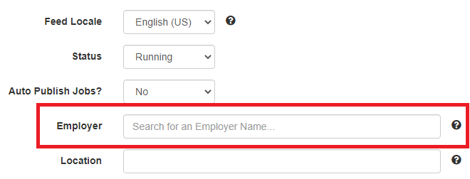

## Automated job scraping for Talent Hub

Latest scrape status:
|scheduled|manual|
|-|-|
|[](https://github.com/VectorInstitute/talent-hub-extractor/actions?query=event%3Aschedule)|[](https://github.com/VectorInstitute/talent-hub-extractor/actions?query=event%3Arepository_dispatch)|

## Documentation [WIP]
- [Setup and running locally](#setup-and-running-locally)
  - [Installing requirements](#installing-requirements)
  - [Running the scraper](#running-the-scraper)
  - [Running the filter](#running-the-filter)
  - [Running the merger](#running-the-merger)
- [Overview of workflow](#overview-of-workflow)
- [Configuration files](#configuration-files)
  - [Filter configuration](#filter-configuration)
    - [Basic regex used in filters](#basic-regex-used-in-filters)
  - [Scraper configuration](#scraper-configuration)
    - [Company-level fields](#company-level-fields)
    - [Job list fields](#job-list-fields)
    - [Job details fields](#job-details-fields)
- [XPath & CSS selectors](#xpath--css-selectors)
  - [XPath queries](#xpath-queries)
    - [Basic syntax](#basic-syntax)
    - [Conditions and logical operations](#conditions-and-logical-operations)
    - [Positional and relative selections](#positional-and-relative-selections)
    - [Functions](#functions)
  - [CSS selectors](#css-selectors)
    - [Basic syntax](#basic-syntax-1)
    - [Conditions and logical operations](#conditions-and-logical-operations-1)
    - [Positional and relative selections](#positional-and-relative-selections-1)
- [Sanity checks and verification tips](#sanity-checks-and-verification-tips)

## Setup and running locally

### Installing requirements

1. Clone the repository
2. Install Python version 3+ (available from https://www.python.org/downloads/)
3. Install the required packages by `cd`-ing into [`src`](src/) and running `python -m pip install -r requirements.txt`
4. Install Docker (available from https://docs.docker.com/get-docker/)

### Running the scraper

1. Run `sh scripts/run-splash.sh` to start a Splash server
2. `cd` into [`src/scraper`](src/scraper/)
3. Run the command `python scraper [config_file] [output_file]`
   - Replace `[config_file]` with the path to the appropriate configuration file (for example: 
  `../../config/scraper/td.scraper.config`)
   - Replace `[output_file]` with the name and format of the output file you want to create
  (for example, to get a CSV as an output: `example.csv`; to get an XML as an output:
  `example.xml`)

### Running the filter

1. `cd` into [`src`](src/)
2. Run the command `python filter.py [filter_folder] [input_files] <output_folder>`
   - Replace `[filter_folder]` with a folder containing filter configuration files (for example: `../../config/filter/`)
   - Replace `[input_files]` with a file or a wildcard pattern for a set of input files
  (for example, to filter a single file: `example.csv`; to filter all CSV files inside a folder:
  `"../out/*.csv"`)
   - (Optional) replace `<output_folder>` with an **existing** folder to store the filtered results (for example: `./filtered/`)
   - **Note**: The filter only supports filtering of CSV output files.
   - **Note**: If `<output_folder>` is not provided, the original files will be overwritten.

### Running the merger

1. `cd` into [`src/scraper/scraper`](src/scraper/scraper/)
2. Run the command `python merger.py [input_files] [output_file]`
   - Replace `[input_files]` with a file or a wildcard pattern for a set of input files
  (for example, to merge a single file: `example.csv`; to merge all CSV files inside a folder:
  `"../out/*.csv"`)
   - Replace `[output_file]` with the name of the output file you want to create (for example: 
  `./merged.xml`)
   - **Note**: the output will be in XML format

## Overview of workflow

The extractor uses GitHub in order to scrape the specified job sites and generate
an XML feed which can be processed by JobBoard. The following outlines the steps that are performed:

1. A user creates a scraper configuration file for a job site
with the name `[site].scraper.config`,
and places it in the folder [`config/scraper`](config/scraper).
   - **Example**: the configuration file for Deloitte is [`config/scraper/deloitte.scraper.config`](config/scraper/deloitte.scraper.config)
1. The scheduled GitHub Actions workflow [`scraper`](.github/workflows/scraper.yml) performs the scraping process and generates the XML feed.
   1. The workflow step `prepare-matrix` gathers all the configuration files matching the form `[site].scraper.config` from the [`config/scraper`](config/scraper) folder and creates a separate scraping step for each one
   2. The workflow step `scrape` performs the bulk of the scraping. It allows multiple job sites to be scraped in parallel. For each site, it runs the **`scraper`** Python script to a produce a CSV file and then uploads the CSV file as an artifact to GitHub actions
      - **Note**: the artifacts can be viewed and downloaded by opening an action run (e.g.: https://github.com/VectorInstitute/talent-hub-extractor/actions/runs/397660426)
   3. The workflow step `filter-and-merge` collects the CSV outputs of all the scraping steps of the different job sites. Then it runs the **`filter`** Python script, applying the filters specified in the [`config/filter`](config/filter) folder. Next, it runs the **`merger`** Python script to convert the CSV files into XML files (and merges them, in the case of the merged XML feed). Finally, it pushes the updated XML files to the [GitHub Pages](https://github.com/VectorInstitute/talent-hub-extractor/tree/gh-pages) branch so that they can be imported into JobBoard.
      - **Note**: `filter-and-merge` must wait for all `scrape` steps to finish before running
      - **Note**: `filter-and-merge` also uploads the generated XMLs as artifacts
2. The XML importer in JobBoard is set up to process the XML feed located at the specified GitHub Pages URL.
   - **Example**: the RBC JobBoard importer is set up to process the XML feed at https://vectorinstitute.github.io/talent-hub-extractor/rbc.xml
   - **Note**: this URL must be publicly available for JobBoard to be able to access it

## Configuration files

### Filter configuration

There are two kinds of filter configuration files: global filter and site-specific filter.
The global filter configuration is stored in [`all.filter.config`](config/filter/all.filter.config), and the filter script applies those filters to all the companies.
A site-specific filter configuration file must be stored in [`config/filter`](config/filter) and have a name matching `[site].filter.config`
in order to be picked up by the filter workflow.

The fields of a filter configuration file **must exactly match** the fields of the input
CSV file.

**Example**: In [`all.filter.config`](config/filter/all.filter.config), we apply a filter
to the `location` field of the CSV file, which can be found in all of the CSV files.

The field values correspond to a regular expression (regex) that the corresponding field should match.

**Example**: `location = toronto|ontario|\bON\b|remote|virtual` checks that the location
field of each job contains one of: "toronto", "ontario", "\bON\b", "remote" or "virtual".

#### Basic regex used in filters
| Symbol | Meaning             | Example                                                                                                                                |
|--------|---------------------|----------------------------------------------------------------------------------------------------------------------------------------|
| `\|`   | logical or operator | `toronto\|ontario` means the text should contain "toronto" or "ontario"                                                                 |
| `\b`   | word boundary       | `\bON\b` means the text must contain the string "ON" unconnected to any other text. That is, the text "cONtained" will not be accepted |

See https://regex101.com/ for more detailed documentation of regex operators and various examples.

### Scraper configuration

A scraper configuration file must be stored in [`config/scraper`](config/scraper) and have a name matching `[site].scraper.config`
in order to be picked up by the scraper workflow.
A template scraper configuration file is provided in [TEMPLATE.scraper.config](config/TEMPLATE.scraper.config).

The configuration is separated into 3 sections: **Company-level fields**, **Job list fields**, and **Job details fields**.

#### Company-level fields

- **`company_name`** (string): corresponds to the `company` XML field for the JobBoard XML importer.
  - **Note**: (As of Dec. 2020) the `company` XML field does not automatically assign an imported job
  to the matching employer in JobBoard. The only way to accomplish this at the moment is to set up the Employer in the XML importer screen:
  
- **`url`** (string): corresponds to the main (i.e. first page of results) URL used for scraping.
  - **Note**: Any percentage (%) symbol in the URL must be properly escaped. For example,
  the URL `https://jobs.td.com/en-CA/job-search-results/?keyword=Ontario&addtnl_categories=Enterprise%20Data%20%26%20Analytics` should be entered in the config
  as: `https://jobs.td.com/en-CA/job-search-results/?keyword=Ontario&addtnl_categories=Enterprise%%20Data%%20%%26%%20Analytics`(note the extra percentage symbols)
  - **Note**: At the moment, the scraper only supports a single URL for scraping

#### Job list fields

The fields in this section specify how the scraper should recognize and handle job links
appearing in the job search results.

- **`joblist.link.xpath`** (XPath): an XPath query returning a single link to a job from
the search results.
  - **Note**: the XPath query should return a single `<a>` node
  - **Example**: For TD Bank Group, this is given by `//div[@class="jobTitle"]/a`
- **`joblist.pagination`** (NONE|NEXTPAGE|PAGENUMBER|INFINITESCROLL): specifies the 
pagination behaviour that the scraper should use for this website, in order to
correctly move to the next page of job results.
  - **NONE**: indicates that this website has no pagination (i.e. all job results
  are found on a single page)
  - **NEXTPAGE**: indicates that this website has a "Next" button to move to
  the next page of the job results
  - **PAGENUMBER**: indicates that this website has separate buttons for
  each page of the results, but there is no "Next" button available.
  - **INFINITESCROLL**: (WIP) indicates that this website has an
  infinite scroll view of the job results, where a user has to 
  click a button or scroll down to load the next batch of results
- **`joblist.nextpage.css`** (CSS selector): a CSS selector returning a button
corresponding to the next page, which can be clicked by the scraper.
  - **Note**: this field is currently only required for **NEXTPAGE** and **PAGENUMBER**
  pagination behaviour.
  - **Note**: if `joblist.pagination` is set to **PAGENUMBER**, the CSS selector
  should contain a `$PAGENUMBER` placeholder somewhere. This placeholder will be dynamically
  replaced, by the scraper, with the correct page number for each subsequent page.
  - **Example**: For TD Bank Group, this is given by `a[aria-label="Go to the next page of results."]`
  - **Example**: For Deloitte, this is given by `ul.pagination a[title="Page $PAGENUMBER"]`

#### Job details fields

- **`jobdetails.title.xpath`** (XPath): an XPath query returning a single text node containing the job title on the job details page.
  - **Note**: the XPath query must return a single `text()` node
  - **Example**: For TD Bank Group, this is given by `//h1[@id="gtm-jobdetail-title"]/text()`. This will return the text node of the `<h1>`
  element with the ID "gtm-jobdetail-title".
- **`jobdetails.location.xpath`** (XPath): an XPath query returning a single text node
containing the job location on the job details page.
  - **Note**: the XPath query must return a single `text()` node
  - **Example**: For TD Bank Group, this is given by `concat(//span[@id="gtm-jobdetail-city"]/text(), ", ", //span[@id="gtm-jobdetail-state"]/text())`. This will return the concatenation of two text nodes: a `<span>` node with
  the ID "gtm-jobdetail-city", and a `<span>` node with the ID "gtm-jobdetail-state". This is necessary to create a single text node consisting
  of the city and state portions.
- **`jobdetails.description.xpath`** (XPath): an XPath query returning a parent HTML element with all of its descendants (or a collection of HTML parent elements), specifying the job description.
  - **Example**: For TD Bank Group, this is given by `//div[@id="gtm-jobdetail-desc"]`. This will return the parent `<div>` with the ID "gtm-jobdetail-desc", and all of its descendants
  - **Example**: For Borealis AI, this is given by `//div[@class="container"]//section[@class="section section--no-divider" and not(.//a[text()="Apply"])]`.
  This will return a collection of parent `<section>` elements which have class
  "section section--no-divider", but exclude any `<section>` elements which
  have an "Apply" button as a descendant. This is necessary to prevent the description from capturing the apply button.
- **`jobdetails.is_url_application`** (True|False): a boolean specifying whether
the XML should be populated with the job URL as the apply method.
  - **Note**: If set to **False**, the field `jobdetails.application_email` must 
  be set appropriately.
- **`jobdetails.application_email`** (string): the email address to be used for applications.
  - **Note**: This field is ignored if `jobdetails.is_url_application` is set
  to **True**
- **`jobdetails.logo`** (string): a URL corresponding to the company logo
to be included in the XML for this job.
- **`jobdetails.url_utm_params`** (string): URL parameters to be appended
to the job posting URL (if company is configured to use URLs)
  - **Note**: Any percentage (%) symbol in the URL parameters must be properly escaped. For example,
  the URL parameters `?utm_source=Vector%20Digital%20Talent%20Hub&utm_medium=job%20link&utm_campaign=Vector%20Digital%20Talent%20Hub` should be entered in the config
  as: `?utm_source=Vector%%20Digital%%20Talent%%20Hub&utm_medium=job%%20link&utm_campaign=Vector%%20Digital%%20Talent%%20Hub` (note the extra percentage symbols)
  - **Note**: This field is ignored if `jobdetails.is_url_application` is set
  to **False**
  - **Note**: Set the value of this field to `None` if no parameters should be provided.

## XPath & CSS selectors

XPath queries and CSS selectors are used by the scraper to pinpoint
HTML elements to scrape and interact with. They perform a search
over the full HTML source and return all matching elements.

### XPath queries

#### Basic syntax

`//parent[conditions...]/child[conditions...]`

- `//` indicates that we are searching anywhere on the page
- `parent` is the parent element we are looking for
- `parent/child` indicates that we are looking for `child` elements
which are direct children of `parent`
  - alternative: `parent//child` indicates that we want to return `child`
  elements at *any* level below `parent` (i.e. they could be grandchildren)
- `[conditions...]` is an optional list of conditions that we should
be checking
- `child[conditions...]` are the elements the query will return

Example: `//div[@class="page-header__title"]/h1`

This query looks for `<div>` elements anywhere in the page which
have the CSS class `"page-header__title"`, and returns `<h1>`
direct children of those elements.

Matching HTML:

```html
<div class="page-header__title">
  <h1>Head of Marketing</h1>
</div>
```

Returns: 
```html 
<h1>Head of Marketing</h1>
```

#### Conditions and logical operations

Conditions are provided inside the square brackets following an element.
In general, they may include XPath queries within them too.

| Condition Syntax                  | Description                                | Example                                            |
|-----------------------------------|--------------------------------------------|----------------------------------------------------|
| `@attribute="value"`              | `attribute` must match `"value"` *exactly* | `@class="page-header__title"`                      |
| `contains(@attribute, "value")`   | `attribute` must contain `"value"`         | `contains(@class, "job-card-wrapper")`             |
| `condition1... and condition2...` | must match `condition1` and `condition2`   | `@class="title" and contains(text(), "Location:")` |
| `condition1... or condition2...`  | must match `condition1` or `condition2`    | `@class="title" or contains(text(), "Location:")`  |
| `not(condition...)`               | `condition` should not be matched          | `div[not(contains(@class, 'apply-page-body'))]`    |

#### Positional and relative selections

In addition to specifying conditions, square brackets can also be used to select 
particular elements out of a collection using exact or relative indexing.

| Syntax                        | Description                                                         | Example                                                                                                                                                                        |
|-------------------------------|---------------------------------------------------------------------|--------------------------------------------------------------------------------------------------------------------------------------------------------------------------------|
| `[1]` or `[2]` or `[<n>]`...  | Select only the `<n>`th element from the collection                 | `//p[@class="jv-job-detail-meta"]//node()[1]` selects only the first node that is a descendant of the appropriate `<p>`                                                        |
| `[last()]`                    | Selects the last element from the collection                        | `//p[@class="jv-job-detail-meta"]//node()[last()]` selects the last node that is a descendant of the appropriate `<p>`                                                         |
| `/following-sibling::element` | Select all siblings of type `element` following the current element | `strong[contains(text(), "Primary Location")]/following-sibling::node()[1]` selects any type of sibling (indicated by `node()`) of `<strong>`, then returns only the first one |
| `/preceding-sibling::element` | Select all siblings of type `element` preceding the current element | `span[@show.bind="jobDetail.category"]/preceding-sibling::span` selects all `<span>` elements preceding the `<span>` with "jobDetail.category"                                 |

#### Functions

There are various functions we can apply to the results of XPath 
queries to get more robust behaviour.
Most functions can also be used inside conditions.

| Function   | Syntax                            | Description                                                                                                           |
|------------|-----------------------------------|-----------------------------------------------------------------------------------------------------------------------|
| `text()`   | `element/text()`                  | Return only the text node of element                                                                                  |
| `node()`   | `element/node()`                  | Return any node (including text nodes)                                                                                |
| `last()`   | `[last()]`                        | Returns the last element of a collection                                                                              |
| `concat()` | `concat(expr1..., expr2..., ...)` | Concatenates the results of expr1, expr2 and so on. Each expression should be a string (e.g. the result of `text()`). |

See also https://devhints.io/xpath for a cheatsheet of various XPath functionalities and https://developer.mozilla.org/en-US/docs/Web/XPath for more detailed documentation for XPath.

### CSS selectors

#### Basic syntax

`parent[conditions...] descendant.class`

- `parent` is the parent element we are looking for
- `parent(SPACE)descendant` indicates that we are looking for `descendant`s
of `parent` element
  - alternative: `parent > child` indicates that we are looking for direct
  children of `parent`
- `descendant.class` indicates that we are looking for `descendant` elements
with the class `class`
- `parent[conditions...]` specifies potential conditions on attributes of `parent`

Example: `ul.pagination a[title="Page 3"]`

This query looks for `<ul>` elements with a `pagination` class
that have `<a>` elements with the title `"Page 3"`
as descendants, and returns the `<a>` element.

Matching HTML:

```html
<ul class="pagination">
  <li>
    <a class="paginationItemFirst" href="?q=&amp;sortColumn=referencedate&amp;sortDirection=desc" title="First Page">«</a>
  </li>
  <li class="active">
    <a href="?q=&amp;sortColumn=referencedate&amp;sortDirection=desc" rel="nofollow" title="Page 1">1</a>
  </li>
  <li class=" ">
    <a href="?q=&amp;sortColumn=referencedate&amp;sortDirection=desc&amp;startrow=25" rel="nofollow" title="Page 2">2</a>
  </li>
  <li class=" ">
    <a href="?q=&amp;sortColumn=referencedate&amp;sortDirection=desc&amp;startrow=50" rel="nofollow" title="Page 3">3</a>
  </li>
  <li class=" ">
    <a href="?q=&amp;sortColumn=referencedate&amp;sortDirection=desc&amp;startrow=75" rel="nofollow" title="Page 4">4</a>
  </li>
  <li class=" ">
    <a href="?q=&amp;sortColumn=referencedate&amp;sortDirection=desc&amp;startrow=100" rel="nofollow" title="Page 5">5</a>
  </li>
</ul>
```

Returns: 
```html 
<a href="?q=&amp;sortColumn=referencedate&amp;sortDirection=desc&amp;startrow=50" rel="nofollow" title="Page 3">3</a>
```

#### Conditions and logical operations

Conditions are provided inside the square brackets following an element.
In general, they may include XPath queries within them too.

| Condition Syntax | Description                                | Example             |
|------------------|--------------------------------------------|---------------------|
| `attr="value"`   | `attribute` must match `"value"` *exactly* | `a[title="Page 3"]` |
| `attr~="value"`  | `attribute` must contain `"value"`         | `a[title~="Page"]`  |
| `attr^="value"`  | `attribute` must start with `"value"`      | `button[aria-label^="Next Page"]`  |

#### Positional and relative selections

In addition to specifying conditions, square brackets can also be used to select 
particular elements out of a collection using exact or relative indexing.

| Syntax              | Description                                                  | Example                                                                                             |
|---------------------|--------------------------------------------------------------|-----------------------------------------------------------------------------------------------------|
| `:first-of-type`    | Select the first child of the specified type of any parent   | `a.next-page-btn:first-of-type` selects the first `<a>` child element with a `next-page-btn` class  |
| `:nth-of-type(<n>)` | Select the `<n>`th child of the specified type of any parent | `a.next-page-btn:nth-of-type(3)` selects the third `<a>` child element with a `next-page-btn` class |

See also https://www.w3schools.com/cssref/css_selectors.asp and https://developer.mozilla.org/en-US/docs/Web/CSS/Reference for more detailed documentation of CSS selectors.

## Sanity checks and verification tips

The following are some basic tips for checking that the scraping was completed successfully.

1. Check running time for each step of the workflow.
   - A step might indicate that it succeeded, but did not create the expected output. All scrape steps should take at least ~1 min to complete,
  even if there are no jobs to scrape.
2. Check for errors in scrape steps.
   - Each scrape steps outputs the scraping progress in the **"Run scraper"** sub-step. For every job that is scraped you should see
  output like "Parsing job details: ...", or "Failed to scrape job (...)". The provided URLs can be used to verify the correctness of the scraper.
3. Check for errors in the filter step.
   - In the **"Run filter"** sub-step of the `filter-and-merge` step, the filter outputs the original and filtered number of rows for each CSV that it scraped,
  and if any CSVs were skipped.
   - The workflow provides artifacts of the raw scraped CSVs as well as the filtered scraped CSVs for comparison.
4. Check for errors in the merger step.
   - In the **"Run merger"** sub-step of the `filter-and-merge` step, the merger outputs how many CSVs were merged, and if any were skipped.